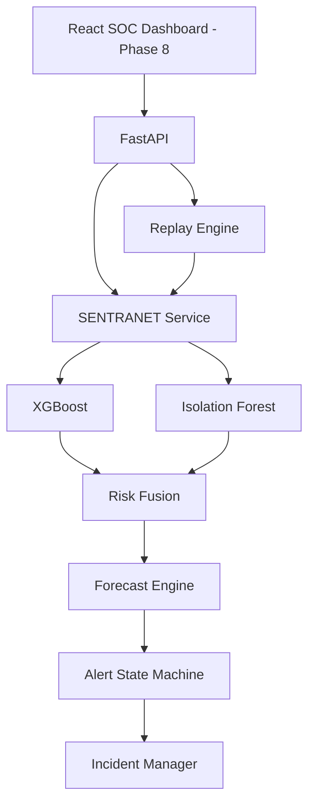

# PHASE 7 FINAL AUDIT REPORT — FASTAPI SERVICE LAYER

**Project:** SENTRANET — From Detecting Attacks to Forecasting Them  
**SIH 2026 Problem Statement:** SIH26153  
**Theme:** Blockchain & Cybersecurity  
**Category:** Software  
**Status:** COMPLETE (Zero Regressions, 84/84 Tests Passing)  
**Date:** September 30, 2026  

---

## 1. Executive Summary

Phase 7 of SENTRANET successfully establishes the HTTP service layer that exposes the full detection, anomaly scoring, risk fusion, temporal trajectory forecasting, and incident alerting pipeline through clean, typed REST APIs.

Rather than retraining models or altering the underlying machine learning logic, Phase 7 wraps the existing Phase 2–6 engines (`ForecastEngine`, `AlertStateMachine`, `IncidentManager`, and `ReplayEngine`) into a thread-safe, in-memory FastAPI architecture. The service layer strictly enforces chronological causality, forbids client-side feature order assumptions, provides robust concurrency protection against overlapping replays, and ensures that internal exceptions and stack traces never leak to external clients.

All 84 automated tests across Phases 1 through 7 pass with zero regressions.

---

## 2. API Architecture



---

## 3. Files Created and Modified

### Created Files
- `config/api.yaml`: Declarative API metadata, operational limits, and CORS origins (`http://localhost:5173`).
- `backend/api/__init__.py`: Package entry point exposing canonical `app`, `api_router`, and service singletons.
- `backend/api/app.py`: FastAPI app instance with lifespan manager, CORS middleware, and safe global exception handlers.
- `backend/api/dependencies.py`: Dependency injection providers for `SentranetService` and `ReplayService`.
- `backend/api/errors.py`: Typed HTTP exception hierarchy (`BadRequestException`, `ResourceNotFoundException`, `ConflictException`, `ServiceUnavailableException`).
- `backend/api/schemas/errors.py`: Standardized structured error schemas.
- `backend/api/schemas/health.py`: Schemas for `/api/health` and `/api/system/status`.
- `backend/api/schemas/status.py`: Compatibility status schema exports.
- `backend/api/schemas/inference.py`: Strict 17-feature schema (`NetworkFeatures`), `AnalyzeRequest`, `AnalyzeResponse`.
- `backend/api/schemas/alerts.py`: Schemas for active and historical alert events.
- `backend/api/schemas/incidents.py`: Incident summary and detail response schemas.
- `backend/api/schemas/timeline.py`: Chronological risk timeline points and series schema.
- `backend/api/schemas/replay.py`: Control schemas for batch, realtime, and step playback.
- `backend/api/schemas/__init__.py`: Comprehensive schema aggregation.
- `backend/api/services/serializers.py`: Sanitizer transforming internal objects/floats into JSON-compliant structures.
- `backend/api/services/sentranet_service.py`: Central state manager, model cache, and timeline coordinator.
- `backend/api/services/replay_service.py`: Thread-safe replay simulation service.
- `backend/api/routes/__init__.py`: Aggregate API router.
- `backend/api/routes/health.py`: Health check endpoint route.
- `backend/api/routes/system.py`: System status inspection route.
- `backend/api/routes/inference.py`: `/analyze`, `/stream/reset`, and `/risk/current` routes.
- `backend/api/routes/alerts.py`: `/alerts/current` and `/alerts` routes.
- `backend/api/routes/incidents.py`: `/incidents` and `/incidents/{id}` routes.
- `backend/api/routes/timeline.py`: `/timeline` risk trajectory history route.
- `backend/api/routes/replay.py`: Full replay lifecycle control routes.
- `tests/test_api_health.py`: 4 automated tests for health, status, docs, and CORS.
- `tests/test_api_inference.py`: 9 automated tests for validation, schema, NaN/Inf rejection, and ordering.
- `tests/test_api_alerts.py`: 3 automated tests for alert states and filtering.
- `tests/test_api_incidents.py`: 3 automated tests for incident lifecycle and 404s.
- `tests/test_api_replay.py`: 5 automated tests for batch, realtime, pause, resume, and stop.
- `tests/test_api_causality.py`: Critical end-to-end integration test over 20 temporal windows.
- `docs/phase7_fastapi.md`: Comprehensive Phase 7 technical documentation.

### Modified Files
- `backend/app/main.py`: Re-exports canonical application from `backend.api.app` ensuring backward compatibility and preventing duplicate app instances.
- `backend/replay/replay_engine.py`: Updated `__init__` signature to optionally accept existing `IncidentManager` and `AlertStateMachine` instances, allowing shared in-memory state.
- `backend/tests/test_health.py`: Updated assertion boundaries to accommodate Phase 7 production response schemas while maintaining Phase 1 compatibility.

---

## 4. Endpoint Inventory

| HTTP Method | Route | Description | Auth / Speed | Status Codes |
|:---|:---|:---|:---|:---|
| `GET` | `/api/health` | Fast liveness probe (no ML load) | None / < 5ms | 200 |
| `GET` | `/api/system/status` | Engine and pipeline readiness status | None / < 5ms | 200 |
| `POST` | `/api/analyze` | Single window ML detection and forecasting | None / < 25ms | 200, 400, 409, 422, 503 |
| `POST` | `/api/stream/reset` | Resets in-memory stream and alert state | None / < 5ms | 200, 409 |
| `GET` | `/api/risk/current` | Latest computed risk decision | None / < 5ms | 200, 404 |
| `GET` | `/api/alerts/current` | Active alert condition & incident summary | None / < 5ms | 200 |
| `GET` | `/api/alerts` | Chronological alert event log | None / < 5ms | 200 |
| `GET` | `/api/incidents` | Correlated incident summaries | None / < 5ms | 200 |
| `GET` | `/api/incidents/{id}` | Detailed incident breakdown | None / < 5ms | 200, 404 |
| `GET` | `/api/timeline` | Risk/anomaly trend history for frontend charts | None / < 5ms | 200 |
| `POST` | `/api/replay/start` | Launch historical replay (batch, realtime, step) | None / Background | 200, 400, 409 |
| `POST` | `/api/replay/stop` | Terminate background replay simulation | None / Instant | 200 |
| `POST` | `/api/replay/pause` | Pause realtime playback clock | None / Instant | 200, 409 |
| `POST` | `/api/replay/resume` | Resume paused playback clock | None / Instant | 200, 409 |
| `POST` | `/api/replay/step` | Advance replay by 1 temporal window | None / < 15ms | 200 |
| `GET` | `/api/replay/status` | Current progress, speed, window metrics | None / < 5ms | 200 |
| `GET` | `/api/replay/events` | Telemetry windows emitted during replay | None / < 5ms | 200 |
| `GET` | `/docs` | Interactive Swagger UI | None / Browser | 200 |
| `GET` | `/redoc` | Interactive ReDoc UI | None / Browser | 200 |
| `GET` | `/openapi.json` | OpenAPI 3.1 specification schema | None / JSON | 200 |

---

## 5. Model Initialization & Memory Management

- **Single Initialization:** Model artifacts (`xgboost_model.json`, `isolation_forest.joblib`, `scaler.joblib`) are loaded exactly once during service instantiation. No models are reloaded per HTTP request.
- **In-Memory Architecture:** Temporal state (sliding window histories, risk velocities, alert buffers) is maintained entirely in RAM using thread-safe structures bounded to a maximum of 500 records to prevent memory leaks.
- **Zero Heavy Infrastructure:** Celery, Redis, Kafka, and PostgreSQL are explicitly excluded, keeping runtime deployment self-contained and lightweight.

---

## 6. Temporal State, Ordering & Causality

- **Strict Causality ($T_i > T_{i-1}$):** If a window timestamp precedes the latest processed timestamp, HTTP 409 `OUT_OF_ORDER_TIMESTAMP` is returned.
- **Duplicate Protection ($T_i = T_{i-1}$):** If the exact same timestamp is submitted twice, HTTP 409 `DUPLICATE_TIMESTAMP` is returned.
- **No Ground-Truth Leakage:** The API requests accept features only. Labels and ground truth classes are never passed or accessible during online inference.

---

## 7. Replay Concurrency & Reset Safety

- **Concurrency Prevention:** If a replay is running, initiating another replay via `POST /api/replay/start` returns HTTP 409 `REPLAY_ALREADY_RUNNING`.
- **Reset Guard:** Attempting to reset the temporal stream via `POST /api/stream/reset` while a background replay is executing returns HTTP 409 `STREAM_REPLAY_ACTIVE`.
- **Responsive Background Execution:** Realtime playback uses a Python daemon thread paced by a responsive `threading.Event`, allowing instant pauses and stops without blocking thread hangs.

---

## 8. Security Baseline & Error Handling

- **No Exception Leaks:** Custom exception handlers intercept `APIException`, `RequestValidationError`, `StarletteHTTPException`, and generic `Exception`. Internal tracebacks are logged server-side with structured logging and never exposed to HTTP clients.
- **NaN / Infinity Sanitization:** Pydantic validation catches non-finite floats, and error serializers sanitize `nan` and `inf` inputs to prevent JSON encoding errors.
- **CORS Protection:** Preflight origins are restricted to `http://localhost:5173` and `http://127.0.0.1:5173` as declared in `config/api.yaml`.
- **Path Traversal Defense:** Arbitrary file paths are rejected by `ReplayService`; only predefined dataset presets (`validation`, `test`, `train`, `full`) are accepted.

---

## 9. Automated Test Results

Full test suite execution (`pytest tests/ backend/tests/ -v`):

```
=================================== RESULTS ===================================
tests/test_alert_state_machine.py:            5 PASSED
tests/test_api_alerts.py:                     3 PASSED
tests/test_api_causality.py:                  1 PASSED (Critical E2E 20-window stream)
tests/test_api_health.py:                     4 PASSED
tests/test_api_incidents.py:                  3 PASSED
tests/test_api_inference.py:                  9 PASSED
tests/test_api_replay.py:                     5 PASSED
tests/test_data_pipeline.py:                 10 PASSED
tests/test_dual_engine.py:                    2 PASSED
tests/test_forecast_no_leakage.py:            3 PASSED
tests/test_isolation_forest_inference.py:     7 PASSED
tests/test_isolation_forest_reload.py:        1 PASSED
tests/test_phase3_schema.py:                  3 PASSED
tests/test_replay_engine.py:                  5 PASSED
tests/test_risk_fusion.py:                    7 PASSED
tests/test_risk_trajectory.py:                4 PASSED
tests/test_xgboost_inference.py:              8 PASSED
tests/test_xgboost_reload.py:                 1 PASSED
backend/tests/test_health.py:                 2 PASSED
===============================================================================
TOTAL: 84 PASSED, 0 FAILED (Duration: 6.49s)
```

---

## 10. Manual API Verification Steps

To test the live server interactively:

1. **Launch the server:**
```bash
source backend/.venv/bin/activate
uvicorn backend.api.app:app --host 127.0.0.1 --port 8000 --reload
```

2. **Open Swagger Documentation:**
Navigate to `http://localhost:8000/docs` in your browser.

3. **Verify Health:**
```bash
curl -X GET http://127.0.0.1:8000/api/health
```

4. **Reset Stream:**
```bash
curl -X POST http://127.0.0.1:8000/api/stream/reset
```

5. **Start Historical Replay:**
```bash
curl -X POST http://127.0.0.1:8000/api/replay/start \
  -H "Content-Type: application/json" \
  -d '{"mode": "batch", "dataset": "validation"}'
```

6. **Inspect Incidents and Timeline:**
```bash
curl -X GET http://127.0.0.1:8000/api/incidents
curl -X GET http://127.0.0.1:8000/api/timeline?limit=10
```

---

## 11. Known Limitations & Phase 8 Preparation

- **Dataset Boundary:** All data streaming remains strictly historical simulation over preprocessed synthetic fixtures (`data/processed/sample/`). Live packet capture (`pcap`) is not part of Phase 7.
- **In-Memory Storage:** Stream state and incident histories are stored in process memory. Restarting the server resets active temporal states.
- **Phase 8 Ready:** The typed responses, CORS configuration, timeline schemas, and replay controls are fully aligned with the upcoming Phase 8 React SOC dashboard requirements.
