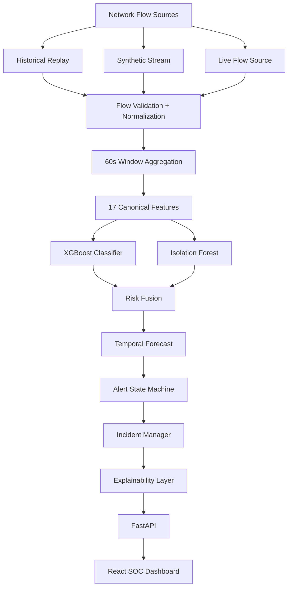

# SENTRANET

> **"From detecting attacks to forecasting them."**

SENTRANET is an advanced AI-driven cybersecurity prototype built for **SIH 2026 (Problem Statement: SIH26153 - Blockchain & Cybersecurity)**. 

While traditional Intrusion Detection Systems (IDS) simply alert on attacks *after* they have occurred, SENTRANET introduces a temporal forecasting engine. By continuously decomposing network telemetry into a dual-model architecture (XGBoost + Isolation Forest), SENTRANET not only classifies active threats but forecasts the trajectory of an attack *before* the critical impact stage.

## 🚀 Core Capabilities

- **Real-Time Threat Classification**: Deterministic 17-feature aggregation mapped to an optimized XGBoost classifier.
- **Unsupervised Anomaly Detection**: Isolation Forest for detecting zero-day deviations and unknown attacker patterns.
- **Predictive Risk Forecasting**: Temporal risk fusion engine predicting emergence and time-to-impact for escalating threats.
- **Forecast Validation**: Dedicated evaluation module for testing early-warning capabilities and lead times on synthetic data without future leakage.
- **Synthetic Replay Engine**: Generates real-time deterministic streaming telemetry to validate UI updates, incident lifecycles, and model inference without live external traffic.
- **Scientific Explainability**: Live, mathematically grounded explanation layer mapping decisions back to the original feature vectors without LLM hallucination.
- **Professional SOC Dashboard**: A React-based Security Operations Center (SOC) visualizing timeline events, incident dossiers, and AI explainability.

---

## 🏗️ Architecture



## 🛠️ Tech Stack

- **Backend**: Python 3.10+, FastAPI, Uvicorn
- **AI/ML**: XGBoost, scikit-learn (Isolation Forest), Pandas, NumPy
- **Frontend**: React, TypeScript, Vite, Tailwind CSS, Lucide Icons, Recharts
- **Testing**: Pytest (178/178 tests passing)

---

## 💻 Setup & Installation

### Prerequisites
- Python 3.10 or higher
- Node.js 18 or higher

### 1. Backend Setup
```bash
python -m venv backend/.venv
source backend/.venv/bin/activate  # On Windows: backend\.venv\Scripts\activate
pip install -r backend/requirements.txt
```

### 2. Frontend Setup
```bash
cd frontend
npm install
cd ..
```

### 3. Environment Config
Copy the example environment variables:
```bash
cp .env.example .env
```

---

## 🏃‍♂️ Running the Demo

SENTRANET features a deterministic, reproducible demo for SIH presentation.

```bash
./scripts/run_demo.sh
```

**What this does:**
1. Starts the FastAPI backend.
2. Starts the React frontend on `http://localhost:5173`.
3. Initiates a `baseline-scanning-attack` synthetic telemetry stream (Seed: 42) to simulate a complete attack lifecycle from baseline to incident.

*For detailed instructions, refer to `docs/DEMO_RUNBOOK.md`.*

---

## 🔬 Evaluation & Scientific Honesty

SENTRANET includes a benchmark evaluation engine (Phase 10) featuring a dedicated **Forecast Validation** module. 
The currently available evaluation results exposed in the UI include the project's **synthetic fixture**. Standard datasets (such as CICIDS2017, UNSW-NB15, or CIC-DDoS2019) are fully compatible with our 17-feature contract. 

**Scientific Limitations & Disclosures:**
1. **Real benchmark datasets are currently unavailable unless the repository proves otherwise.**
2. **Synthetic results must not be presented as benchmark performance.** The 840-second (14 minute) lead time represents the *observed lead time on the deterministic synthetic slow-escalation validation scenario*, not a real-world prediction guarantee.
3. **Risk & Confidence are heuristics.** Risk scores and Forecast Confidences are heuristic indicators derived from model ensembles, NOT calibrated probabilities.
4. **ETA is an estimate.** The Estimated Time to Attack (ETA) is a heuristic estimate, NOT a guaranteed time-to-attack.
5. **No production validation.** The system currently has not been deployed on a live production enterprise network.

**SENTRANET guarantees zero "fake" UI metrics.** Every value on the SOC Dashboard (throughput, risk, anomaly, features) is pulled from actual deterministic API responses generated by the ML pipeline.

---

## 🗂️ Project Structure

- `backend/api`: FastAPI routes and services.
- `backend/telemetry`: Flow ingestion, normalization, and windowing.
- `backend/explainability`: AI decision decomposition layer.
- `backend/replay`: Engine for historical telemetry simulations.
- `frontend/`: React SOC Dashboard.
- `ml/`: The core Risk, Forecasting, and Model pipelines.
- `tests/`: Comprehensive regression suite.
- `scripts/`: Utilities for running demos and evaluations.
- `docs/`: Technical and presentation runbooks.

---

## 🏆 SIH Context & Future Work

Built by **Team OUTLIERS** for the Smart India Hackathon 2026. 

**Future Roadmap:**
- **Packet Payload Inspection**: Extending beyond flow metadata.
- **Automated Firewall Mitigation**: Emitting standard mitigation rules (e.g., iptables, Suricata) directly from the Incident Manager.
- **Cloud Deployment**: Wrapping components into Docker and scaling via Kubernetes for high-availability enterprise environments.
