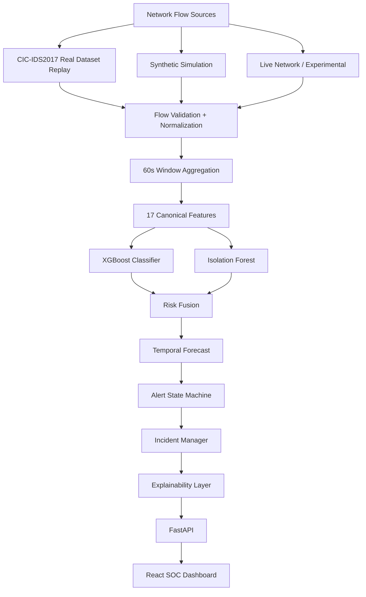

# SENTRANET

> **"From detecting attacks to forecasting them."**

SENTRANET is an advanced AI-driven cybersecurity prototype built by **Team OUTLIERS** for **SIH 2026 (Problem Statement: SIH26153 - Blockchain & Cybersecurity)**. 

While traditional Intrusion Detection Systems (IDS) simply alert on attacks *after* they have occurred, SENTRANET introduces a temporal forecasting engine. By continuously decomposing network telemetry into a dual-model architecture (XGBoost + Isolation Forest), SENTRANET not only classifies active threats but forecasts the trajectory of an attack *before* the critical impact stage.

## 🚀 Core Capabilities & Verified Engineering State

**Core Pipeline:**
Network Flow → 60-second Temporal Window → 17 Canonical Features → XGBoost + Isolation Forest → Risk Fusion → Temporal Forecast → Incident / Alert → AI-assisted SOC

**Current Engineering State:**
- **236 backend tests passing**
- Deterministic model registry for explicit experimentation
- Real-time zero-hallucination explainability layer

**Current Real-Data Validation:**
The SENTRANET architecture has been rigorously validated against the verified **CIC-IDS2017** historical dataset.

- **Dataset Scope**: ~3.1M raw historical flows
- **Temporal Transformation**: 2,454 chronological 60-second windows
- **Chronological Split**: 60/20/20 evaluation

**Known-class test results:**
- 95.02% Accuracy
- 60.21% Macro F1
- 96.33% Weighted F1

**Forecast audit:**
- 9 total forecasts (2 EARLY, 0 ONSET, 7 POST-ONSET, 0 FALSE)
- **Observed EARLY lead times**: 26–27 minutes

*IMPORTANT: The reported early lead time is an observation on the held-out CIC-IDS2017 chronological test sequence. It is not a guaranteed universal prediction, nor a claim of production performance.*

---

## 🏗️ Architecture



## 🛠️ Tech Stack

- **Backend**: Python 3.10+, FastAPI, Uvicorn
- **AI/ML**: XGBoost, scikit-learn (Isolation Forest), Pandas, NumPy
- **Frontend**: React, TypeScript, Vite, Tailwind CSS, Lucide Icons, Recharts
- **Testing**: Pytest (236/236 tests passing)

---

## 💻 Setup & Installation

### Prerequisites
- Python 3.10 or higher
- Node.js 18 or higher

### 1. Backend Setup
```bash
python -m venv backend/.venv
source backend/.venv/bin/activate  # On Windows: backend\.venv\Scripts\activate
pip install -r backend/requirements.txt
```

### 2. Frontend Setup
```bash
cd frontend
npm install
cd ..
```

### 3. Environment Config
Copy the example environment variables:
```bash
cp .env.example .env
```

---

## 🏃‍♂️ Running the Demo

SENTRANET features deterministic, reproducible demonstration paths for SIH presentation.

```bash
./scripts/run_demo.sh
```

**What this does:**
1. Starts the FastAPI backend.
2. Starts the React frontend on `http://localhost:5173`.
3. Initiates the AI-assisted SOC dashboard.

*The UI features explicit model selection and playback controls to switch between the Synthetic Baseline Simulation and the CIC-IDS2017 Experimental Replay.*

---

## 🔬 Evaluation & Scientific Honesty

SENTRANET includes a benchmark evaluation engine featuring a dedicated **Forecast Validation** module. 

**Scientific Limitations & Disclosures:**
1. **Model Selection**: The system utilizes a dual-model registry. The synthetic baseline is the default stability model. The CIC-IDS2017 model is actively marked as **EXPERIMENTAL**.
2. **Real Dataset Constraints**: CIC-IDS2017 replay is explicitly a historical replay of verified data, **NOT live network traffic**.
3. **Novel-Class Detection**: During chronological zero-shot evaluation on CIC-IDS2017, BOTNET (163 test windows) and SCANNING (27 test windows) were unseen during training and were not reliably classified by the existing experimental models. This is a known limitation of chronological novel-class generalization.
4. **Live Packet Capture**: Live network capture is an **experimental feature** that requires OS-level permissions. No synthetic fallback is silently substituted.
5. **No Production Deployment**: The system has not been deployed on a live production enterprise network.

**SENTRANET guarantees zero "fake" UI metrics.** Every value on the SOC Dashboard (throughput, risk, anomaly, features, accuracy) is pulled from actual deterministic API responses generated by the ML pipeline.

---

## 🗂️ Project Structure

- `backend/api`: FastAPI routes and services.
- `backend/telemetry`: Flow ingestion, normalization, and windowing.
- `backend/explainability`: AI decision decomposition layer.
- `backend/replay`: Engine for historical telemetry simulations.
- `frontend/`: React SOC Dashboard.
- `ml/`: The core Risk, Forecasting, and Model pipelines.
- `tests/`: Comprehensive regression suite.
- `scripts/`: Utilities for running demos and evaluations.
- `docs/`: Technical and presentation runbooks.

---

## 🏆 Future Work

**Future Roadmap:**
- **Packet Payload Inspection**: Extending beyond flow metadata.
- **Automated Firewall Mitigation**: Emitting standard mitigation rules (e.g., iptables, Suricata) directly from the Incident Manager.
- **Cloud Deployment**: Wrapping components into Docker and scaling via Kubernetes for high-availability enterprise environments.
