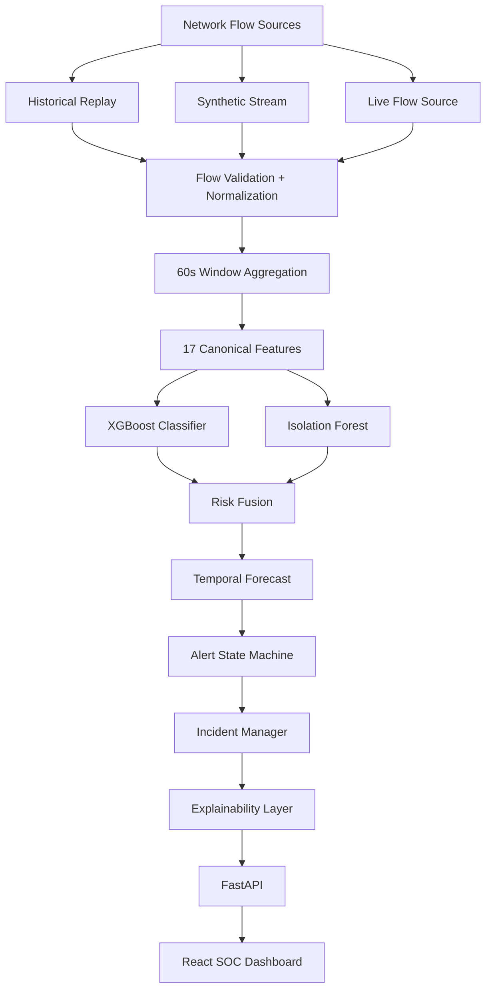

# SENTRANET Architecture

This document describes the high-level architecture of SENTRANET.

## System Flow

The core principle of SENTRANET is processing chronological network flow telemetry in 60-second windows. Raw flows (whether from a live source, historical replay, or synthetic generation) are aggregated and transformed into a strict 17-feature contract. This vector is then evaluated in parallel by a supervised XGBoost classifier and an unsupervised Isolation Forest.

The output probabilities and anomaly scores are mathematically fused into a unified Risk Score. The Temporal Forecaster observes this risk trajectory over time to predict the emergence of an attack *before* it breaches critical thresholds. If an attack emerges, the Alert State Machine emits alerts which the Incident Manager correlates into human-readable Incident Dossiers. Finally, the Explainability Layer extracts feature importance and calculates mathematical justifications for the SOC Dashboard.

## Architecture Diagram

## Component Breakdown

1.  **Telemetry Ingestion (`backend/telemetry`)**: Safely parses inputs into Pydantic schemas, aggregates counts, bytes, and timing vectors per 60-second rolling window.
2.  **Machine Learning Engines (`ml/models`)**:
    *   **XGBoost Classifier**: Predicts known attack signatures with high precision.
    *   **Isolation Forest**: Flags structural anomalies indicative of novel or mutating attacks.
3.  **Risk & Forecasting (`ml/risk`)**: Calculates `Risk = clip(0.60 * class_prob + 0.40 * anomaly, 0, 1)`. Forecasts future risk velocity using historical tracking.
4.  **Alerting & Incidents (`backend/replay` and `backend/api/services`)**: Translates elevated risk and threshold breaches into discrete software events.
5.  **Explainability (`backend/explainability`)**: Evaluates real-time XGBoost gain weights mapped to canonical features to justify the output without using LLMs.
6.  **REST API (`backend/api`)**: FastAPI implementation that acts as the single source of truth for the React frontend, handling state caching via Thread-safe singletons.
7.  **Frontend (`frontend/`)**: React + Tailwind + Vite implementation of a professional Security Operations Center, designed to poll deterministically without WebSockets for maximum resilience and cross-compatibility.
