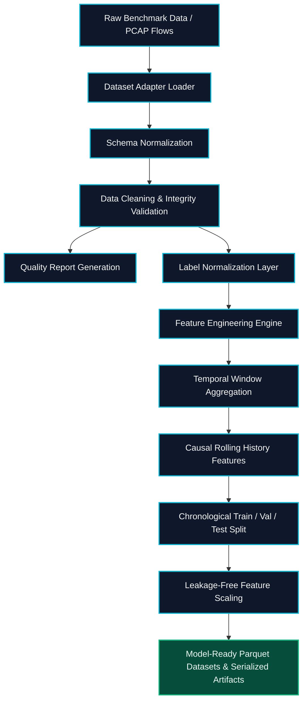

# SENTRANET — Data Pipeline & Preprocessing Architecture

## 1. Overview

The SENTRANET data pipeline transforms heterogeneous benchmark network datasets (`CICIDS2017`, `UNSW-NB15`, `CIC-DDoS2019`) into sanitized, leakage-free, standardized temporal sequences for cyber attack forecasting models.

---

## 2. Pipeline Execution Flow



---

## 3. Detailed Pipeline Stages

### Stage 1: Adapter Loading & Discovery
- Managed via `DatasetRegistry`.
- Discovers `.csv` and `.parquet` partitions dynamically.
- Isolates dataset-specific quirks (e.g. whitespace-padded headers in CICIDS2017).

### Stage 2: Schema Normalization
- Converts raw names into standard canonical fields (`flow_duration`, `forward_packet_count`, `forward_bytes`, etc.).
- Preserves raw string IP identifiers separately from model feature sets.

### Stage 3: Data Cleaning & Integrity Check
- Identifies and eliminates duplicate records.
- Safely converts numerical values; replaces $\pm \infty$ and invalid entries with bounded defaults.
- Verifies timestamp existence and chronologically orders flow events.
- Produces `quality_report.json` with input/output row counts and warning telemetry.

### Stage 4: Label Normalization
- Maps raw multi-class strings into the 5 canonical SENTRANET categories:
  - `BENIGN`
  - `DDOS`
  - `SCANNING`
  - `BOTNET`
  - `OTHER_ATTACK`
- **Strict Integrity Rule**: Unmapped or ambiguous attack categories default to `OTHER_ATTACK`. They are never silently categorized as `BENIGN`.

### Stage 5: Feature Engineering
- Calculates rates (`packet_rate`, `byte_rate`) and packet size statistics (`average_packet_size`).
- Derives directional asymmetry metrics (`packet_ratio`, `byte_ratio`).
- Identifies privileged port targeting (`is_privileged_port`).
- Employs zero-division protection constant ($\epsilon = 10^{-6}$) to prevent mathematical anomalies.

### Stage 6: Temporal Windowing & Causal Aggregation
- Converts discrete flow records into structured temporal slices (default window: $T = 60\text{s}$).
- Computes flow count, total byte/packet intensity, host cardinality, and flag ratios.
- Appends strictly causal rolling historical metrics ($K = 5$ windows), ensuring that window $T$ only references events occurring at or before $T$.

### Stage 7: Chronological Train / Validation / Test Splitting
- Temporal forecasting mandates chronological separation:
  - **Train:** First 70% of chronological sequence.
  - **Validation:** Intermediate 15%.
  - **Test:** Final 15% (future time horizon).
- Completely prevents future data leakage into training representations.

### Stage 8: Leakage-Free Scaling & Artifact Export
- `SafeFeatureScaler` (StandardScaler) fits **strictly on the training split**.
- Validation and test splits are transformed using the training parameters.
- Outputs serialized artifacts (`scaler.joblib`, `label_encoder.joblib`, `feature_names.json`, `schema.json`, `preprocessing_metadata.json`).

---

## 4. Execution Commands

### Inspect Dataset
```bash
python scripts/inspect_dataset.py --dataset cicids2017
# Or for sample fixture:
python scripts/inspect_dataset.py --dataset sample
```

### Run Full Preprocessing Pipeline
```bash
python scripts/prepare_dataset.py \
    --dataset sample \
    --input data/samples/sample_network_traffic.csv \
    --output data/processed/sample \
    --window-size 60
```
