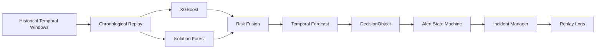

# SENTRANET — Phase 6 Replay & Alerting Documentation

## 1. Objective

Phase 6 implements a chronological replay and alerting streaming engine for **SENTRANET**. It converts preprocessed temporal feature windows into a simulated real-time SOC (Security Operations Center) stream.

> [!IMPORTANT]
> **Scientific Honesty & Simulation Boundary:**  
> This engine is a **historical dataset replay simulation**, not a production packet capture or live network tap system. The development fixture remains **Category B: Synthetic / Generated**. Replay verifies causal pipeline execution, alert lifecycle, incident deduplication, and forecast event emission without lookahead data leakage.

---

## 2. Architecture



---

## 3. Replay Modes & Replay Clock

The `ReplayClock` paces historical playback without modifying original timestamps:

1. **Batch / Fast Mode (`--mode batch`):**
   - High-throughput automated testing mode.
   - Processes all windows sequentially without sleeping.
2. **Real-time Simulation Mode (`--mode realtime --speed <multiplier>`):**
   - Simulates real wall-clock arrival based on inter-window timestamps.
   - Paces stream using `sleep(delta_seconds / speed)`.
3. **Step Mode (`--mode step`):**
   - Interactive diagnostic mode.
   - Advances one temporal window at a time, prompting user input between windows.

---

## 4. Telemetry Event Schemas

### A. `ReplayEvent` (Window-Level Telemetry)
Generated for every temporal window as a presentation/transport wrapper around the Phase 5 `DecisionObject`:
- `event_id`: Deterministic sequential identifier (`EVT-0001`, `EVT-0002`, ...)
- `timestamp`: ISO-8601 window timestamp
- `window_id`: Window identifier
- `attack_class`: Predicted class name (`BENIGN`, `SCANNING`, `DDOS`, `BOTNET`, `OTHER_ATTACK`)
- `class_probability`: Classification confidence ($\max P(c)$)
- `attack_likelihood`: Non-benign probability ($1.0 - P(\text{BENIGN})$)
- `anomaly_score`: Normalized behavioral anomaly score $[0.0, 1.0]$
- `is_anomalous`: Anomaly threshold flag
- `risk_score`: Fused security risk score $[0.0, 1.0]$
- `risk_state`: `LOW`, `GUARDED`, `ELEVATED`, `HIGH`
- `risk_velocity`: Risk rate of change per minute
- `risk_acceleration`: Risk acceleration per minute$^2$
- `risk_trend`: `STABLE`, `RISING`, `RAPIDLY_RISING`, `FALLING`
- `forecast_active`: Boolean forecast indicator
- `forecast_class`: Escalation attack target
- `estimated_eta_seconds`: Estimated time-to-impact
- `forecast_confidence`: Heuristic forecast confidence
- `reasons`: Evidence explanations
- `alert_state`: Current alert machine state (`NORMAL`, `WATCH`, `ALERT`, `RESOLVED`)
- `severity`: `INFO`, `MEDIUM`, `HIGH`
- `replay_mode`: Execution mode

### B. `AlertEvent` (State Transition & Lifecycle Events)
Emitted only when state transitions or critical events occur:
- `alert_event_id`: Deterministic event ID (`ALT-0001`, `ALT-0002`, ...)
- `incident_id`: Deterministic incident ID (`INC-20260930-084200-SCAN-001`)
- `event_type`:
  - `ALERT_CREATED`: New high-risk security incident opened
  - `ALERT_UPDATED`: Continuing high-risk conditions on active incident
  - `ALERT_ESCALATED`: Risk or severity jumped significantly on active incident
  - `ALERT_RESOLVED`: Incident closed after consecutive recovery windows
  - `WATCH_STARTED`: Risk entered `GUARDED` or `ELEVATED` state
  - `WATCH_UPDATED`: Ongoing elevated concern
  - `FORECAST_TRIGGERED`: Attack emergence criteria met with estimated ETA

---

## 5. Alert State Machine & Incident Correlation

### A. State Mapping
- `LOW` Risk ($0.00 - 0.24$) $\longrightarrow$ `NORMAL` (`INFO` severity)
- `GUARDED` ($0.25 - 0.49$) / `ELEVATED` ($0.50 - 0.74$) $\longrightarrow$ `WATCH` (`MEDIUM` severity)
- `HIGH` Risk ($0.75 - 1.00$) $\longrightarrow$ `ALERT` (`HIGH` severity)

### B. Deduplication & Incident Correlation
- When risk enters `HIGH`, the `IncidentManager` assigns a deterministic ID:
  $$\text{INC}-\{YYYYMMDD\}-\{HHMMSS\}-\{\text{CLASS}\}-\{\text{SEQ}\}$$
- Continuing windows of the same attack type update the existing active incident (`ALERT_UPDATED`) rather than flooding the SOC with duplicate incidents.
- If risk drops below `HIGH`, the incident enters a recovery grace period. After `resolution_consecutive_windows` (default = 2), the incident is marked as `RESOLVED`.
- A cooldown window (`cooldown_seconds = 120s`) prevents duplicate incident creation from immediate transient spikes.

---

## 6. Causality & Anti-Leakage Proof

1. **Ground-Truth Label Isolation:** Ground-truth labels (`label`, `label_encoded`) are strictly stripped from the DataFrame before feature vectors enter the ML pipeline.
2. **Chronological Sorting:** All inputs are sorted ascending by timestamp prior to execution.
3. **Temporal Invariance:** Test `test_no_future_leakage` proves that the decision at window $T$ is mathematically identical regardless of whether subsequent windows $T+1 \dots T+N$ are present or omitted.

---

## 7. Replay Artifacts Generated

All replay runs export reproducible artifacts to [`reports/replay/`](file:///Users/zaid/Desktop/PROJECTS/sentranet%202.0/reports/replay/):
- `replay_events.jsonl`: Line-delimited JSON of all window telemetry.
- `alert_events.jsonl`: Line-delimited JSON of alert transitions and lifecycle changes.
- `incident_summary.json`: Complete record of all opened and resolved incidents.
- `replay_summary.json`: High-level execution metrics, window counts, and peak risks.

---

## 8. CLI Usage Examples

```bash
# 1. Fast automated batch replay on full dataset
python scripts/run_replay.py --mode batch --dataset full

# 2. Real-time simulation at 10x accelerated speed
python scripts/run_replay.py --mode realtime --speed 10 --dataset data/processed/sample/validation.parquet

# 3. Interactive step-by-step diagnostic replay
python scripts/run_replay.py --mode step --dataset data/processed/sample/validation.parquet

# 4. Detailed verbose stream output
python scripts/run_replay.py --mode batch --dataset data/processed/sample/test.parquet --verbose
```

---

## 9. Scientific Honesty & Limitations

- **Synthetic Fixture:** All evaluations were conducted on the synthetic development dataset. Step-function transitions limit pre-attack lead times.
- **What Phase 6 Does NOT Claim:** Phase 6 does not claim production packet capture, live enterprise SOC integration, or empirical benchmark performance on CICIDS2017.
