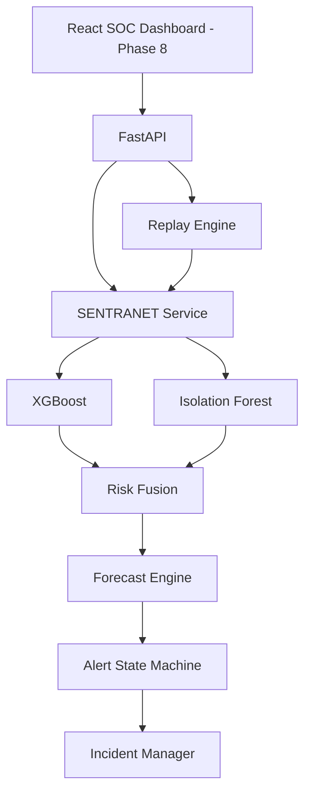

# Phase 7 — FastAPI Service Layer Documentation

**Project:** SENTRANET — From Detecting Attacks to Forecasting Them  
**SIH 2026 Problem Statement:** SIH26153  
**Theme:** Blockchain & Cybersecurity  
**Service Version:** `0.7.0` (Simulation Replay Environment)

---

## 1. Objective

Phase 7 introduces the typed HTTP service layer that exposes the existing Phase 2–6 machine learning, anomaly detection, risk fusion, attack forecasting, and incident alerting engines. 

The primary objective is to convert the offline CLI and model modules into an in-memory, thread-safe service architecture consumed by the upcoming Phase 8 React SOC dashboard.

```
Frontend / Replay / Future Network Stream
                ↓
             FastAPI
                ↓
       SENTRANET Service Layer
                ↓
      Existing Phase 2–6 Engines
                ↓
      DecisionObject / AlertEvent
                ↓
          API Response
```

---

## 2. API Architecture



---

## 3. Application Structure

```
backend/
├── api/
│   ├── __init__.py           # Package exports (app, api_router, singletons)
│   ├── app.py                # Canonical FastAPI application & exception handlers
│   ├── dependencies.py       # Dependency injection providers
│   ├── errors.py             # Custom API exceptions (400, 404, 409, 503)
│   ├── routes/
│   │   ├── __init__.py       # Aggregated api_router
│   │   ├── alerts.py         # /api/alerts, /api/alerts/current
│   │   ├── health.py         # /api/health
│   │   ├── incidents.py      # /api/incidents, /api/incidents/{incident_id}
│   │   ├── inference.py      # /api/analyze, /api/stream/reset, /api/risk/current
│   │   ├── replay.py         # /api/replay/{start, stop, pause, resume, step, status, events}
│   │   ├── system.py         # /api/system/status
│   │   └── timeline.py       # /api/timeline
│   ├── schemas/
│   │   ├── alerts.py         # AlertItemResponse, CurrentAlertResponse
│   │   ├── errors.py         # ErrorResponse, ErrorDetail
│   │   ├── health.py         # HealthResponse, SystemStatusResponse
│   │   ├── incidents.py      # IncidentItemResponse, IncidentDetailResponse
│   │   ├── inference.py      # NetworkFeatures (17 feats), AnalyzeRequest, AnalyzeResponse
│   │   ├── replay.py         # ReplayStartRequest, ReplayStatusResponse, ReplayActionResponse
│   │   ├── status.py         # Status schema alias
│   │   └── timeline.py       # TimelineResponse, TimelinePointResponse
│   └── services/
│       ├── replay_service.py # In-memory thread-safe replay orchestrator
│       ├── sentranet_service.py # Central state manager, model cache & trajectory coordinator
│       └── serializers.py    # Safe serialization to primitive, JSON-compliant types
config/
└── api.yaml                  # API metadata, limits, and CORS configuration
```

---

## 4. Startup & Lifespan

FastAPI utilizes an asynchronous lifespan context manager:
1. `SentranetService.get_instance()` is invoked once during application startup.
2. The 5-class multi-class XGBoost classifier and benign-trained Isolation Forest are loaded and validated against the 17-feature canonical schema.
3. The Alert State Machine and Incident Manager are bound to the service instance.
4. `ReplayService.get_instance()` is initialized, sharing the model and alerting singletons.
5. If initialization fails, an internal log is recorded and any inference attempts return HTTP 503 (`SERVICE_UNAVAILABLE`).
6. Upon graceful shutdown, running background replay simulations are halted and open incidents resolved.

---

## 5. Health API (`GET /api/health`)

- **Method:** `GET`
- **Path:** `/api/health`
- **Description:** Ultra-fast liveness check without invoking machine learning models.
- **Response Schema:**
```json
{
  "status": "ok",
  "service": "sentranet-api",
  "version": "0.7.0",
  "timestamp": "2026-09-30T13:30:00.000000+00:00",
  "simulation": true
}
```

---

## 6. System Status API (`GET /api/system/status`)

- **Method:** `GET`
- **Path:** `/api/system/status`
- **Description:** Verifies component readiness across all models, pipelines, and managers without exposing secrets or paths.
- **Response Schema:**
```json
{
  "service": "SENTRANET",
  "status": "ready",
  "simulation": true,
  "models": {
    "xgboost": "loaded",
    "isolation_forest": "loaded"
  },
  "pipeline": {
    "risk_fusion": "ready",
    "forecast_engine": "ready",
    "alert_engine": "ready",
    "incident_manager": "ready"
  },
  "feature_count": 17
}
```

---

## 7. Telemetry Analysis API (`POST /api/analyze`)

- **Method:** `POST`
- **Path:** `/api/analyze`
- **Description:** Processes a single temporal window through the complete SENTRANET pipeline: XGBoost classification, Isolation Forest anomaly scoring, $\alpha=0.6 / \beta=0.4$ Risk Fusion, risk velocity/acceleration derivatives, emergence detection, attack forecasting, and alert state machine progression.
- **Request Body (Schema Example Only):**
```json
{
  "timestamp": "2026-09-30T10:00:00",
  "features": {
    "flow_count": 0.0,
    "total_packets": 0.0,
    "total_bytes": 0.0,
    "avg_packet_rate": 0.0,
    "avg_byte_rate": 0.0,
    "unique_sources": 0.0,
    "unique_destinations": 0.0,
    "avg_packet_size": 0.0,
    "avg_flow_duration": 0.0,
    "syn_flag_count": 0.0,
    "ack_flag_count": 0.0,
    "privileged_port_ratio": 0.0,
    "rolling_5_flow_count": 0.0,
    "rolling_5_total_packets": 0.0,
    "rolling_5_total_bytes": 0.0,
    "rolling_5_avg_byte_rate": 0.0,
    "rolling_5_unique_sources": 0.0
  }
}
```
- **Response Body (Verified Structure):**
```json
{
  "timestamp": "2026-09-30T10:00:00",
  "attack_class": "SCANNING",
  "class_probability": 0.9625,
  "attack_likelihood": 0.9625,
  "anomaly_score": 0.8312,
  "is_anomalous": true,
  "risk_score": 0.9099,
  "risk_state": "HIGH",
  "risk_velocity": 0.0345,
  "risk_acceleration": 0.0120,
  "risk_trend": "RISING",
  "emergence_detected": true,
  "forecast_active": true,
  "forecast_class": "SCANNING",
  "estimated_eta_seconds": 0,
  "forecast_confidence": 0.7600,
  "alert_state": "ALERT",
  "incident_id": "INC-20260930-100000-SCAN-001",
  "reasons": [
    "Risk score crossed HIGH threshold (0.85)"
  ],
  "alert_event": {
    "event_type": "ALERT_CREATED",
    "incident_id": "INC-20260930-100000-SCAN-001",
    "severity": "HIGH"
  },
  "simulation": true
}
```

---

## 8. Alert APIs

- **`GET /api/alerts/current`**: Retrieves the active alert condition, severity level, reasons, and correlated incident.
- **`GET /api/alerts`**: Returns recent alert lifecycle events (`WATCH_STARTED`, `ALERT_CREATED`, `ALERT_UPDATED`, `ALERT_ESCALATED`, `ALERT_RESOLVED`, `FORECAST_TRIGGERED`).
  - *Query Parameters:* `limit` (1-100, default 20), `severity`, `attack_class`.

---

## 9. Incident APIs

- **`GET /api/incidents`**: Summaries of all correlated incidents created by the IncidentManager. Includes peak risk, max anomaly, event count, and resolution timestamp.
- **`GET /api/incidents/{incident_id}`**: Comprehensive detail for a specific incident, including window timestamp histories and initial vs. peak risk scores. Returns HTTP 404 (`INCIDENT_NOT_FOUND`) if the incident does not exist.

---

## 10. Risk Timeline API (`GET /api/timeline`)

- **Method:** `GET`
- **Path:** `/api/timeline?limit=50`
- **Description:** Provides historical series of chronological points `(timestamp, risk_score, risk_state, anomaly_score, attack_class, forecast_active, eta_seconds)` to power real-time sparklines and multi-series line charts in the frontend.

---

## 11. Historical Dataset Replay APIs

Wraps the Phase 6 `ReplayEngine` without shell subprocesses:
- **`POST /api/replay/start`**: Starts batch, realtime, or step replay.
  - Body: `{"mode": "realtime", "speed": 10.0, "dataset": "validation"}`
  - Predefined dataset aliases: `validation`, `test`, `train`, `full`, `synthetic`. Arbitrary filesystem paths are strictly rejected.
  - Returns HTTP 409 (`REPLAY_ALREADY_RUNNING`) if a simulation is already in progress.
- **`POST /api/replay/stop`**: Halts active background playback, terminates the worker thread, and cleanly resolves any pending incidents.
- **`POST /api/replay/pause`**: Pauses realtime pacing clock.
- **`POST /api/replay/resume`**: Resumes paused playback.
- **`POST /api/replay/step`**: Advances execution by exactly 1 temporal window.
- **`GET /api/replay/status`**: Current progress (`0.0` to `1.0`), processed window count, total windows, speed, and running/paused flags.
- **`GET /api/replay/events`**: Recent telemetry windows and alert records emitted during replay.

---

## 12. Stream Reset API (`POST /api/stream/reset`)

- **Method:** `POST`
- **Path:** `/api/stream/reset`
- **Description:** Clears in-memory temporal sliding windows, derivative histories, alert state machine state, and incident records.
- **Conflict Guard:** Returns HTTP 409 (`STREAM_REPLAY_ACTIVE`) if invoked while a historical replay simulation is actively running.

---

## 13. Error Model & Serialization

All API errors return consistent, machine-readable JSON envelopes:
```json
{
  "error": {
    "code": "OUT_OF_ORDER_TIMESTAMP",
    "message": "Inference timestamp '2026-09-30T10:01:00' precedes the current stream state '2026-09-30T10:02:00'.",
    "details": {}
  }
}
```

- **HTTP 400 (`BAD_REQUEST`):** Malformed syntax or invalid dataset preset.
- **HTTP 404 (`NOT_FOUND`):** Missing state or nonexistent incident ID.
- **HTTP 409 (`CONFLICT`):** Out-of-order timestamp, duplicate timestamp, or concurrent replay attempt.
- **HTTP 422 (`VALIDATION_ERROR`):** Pydantic schema validation failures (NaNs, infinities, missing or extra features). Floats like NaN/Inf are safely sanitized so tracebacks never leak.
- **HTTP 500 (`INTERNAL_ERROR`):** Unhandled server errors; internal stack traces are logged server-side and never sent to clients.
- **HTTP 503 (`SERVICE_UNAVAILABLE`):** Underlying model artifacts unavailable.

---

## 14. Request Validation & Canonical Feature Ordering

Before submitting any feature vector to XGBoost or Isolation Forest, `SentranetService` enforces:
1. Pydantic validation forbidding extra attributes (`extra="forbid"`).
2. Explicit detection and rejection of `NaN` or `inf` values.
3. Feature array extraction using the canonical `expected_features` list from Phase 2 (`feature_names.json`), completely neutralizing client key ordering variations:
```python
canonical_names = self.forecast_engine.classifier.expected_features
feature_vector = np.array([[features_dict[name] for name in canonical_names]], dtype=np.float64)
```

---

## 15. Temporal Ordering & Causality Guarantees

1. Telemetry timestamps must strictly advance in chronological order ($T_{current} > T_{latest}$).
2. Submitting an earlier timestamp yields HTTP 409 `OUT_OF_ORDER_TIMESTAMP`.
3. Submitting an identical timestamp yields HTTP 409 `DUPLICATE_TIMESTAMP`.
4. Inference strictly consumes the 17 numerical telemetry features. Labels, future ground truth, and retrospectives are never accepted or accessed during runtime inference.

---

## 16. CORS Configuration

CORS is managed declaratively via `config/api.yaml`:
```yaml
api:
  cors_origins:
    - "http://localhost:5173"
    - "http://127.0.0.1:5173"
```
Preflight `OPTIONS` requests from the Phase 8 Vite dev server are handled seamlessly.

---

## 17. Automated Testing Suite

84 comprehensive unit and integration tests run via `pytest`:
- **Health & Status:** `tests/test_api_health.py`
- **Inference & Causality:** `tests/test_api_inference.py`, `tests/test_api_causality.py`
- **Alerts & Incidents:** `tests/test_api_alerts.py`, `tests/test_api_incidents.py`
- **Replay & Concurrency:** `tests/test_api_replay.py`
- **Previous Phases (Zero Regressions):** Data pipeline (10), XGBoost (9), Isolation Forest (7), Risk Fusion (7), Risk Trajectory (4), Forecast (3), Alert State Machine (5), Replay Engine (5).

---

## 18. Simulation Boundary & Operational Scope

1. **Category B Synthetic Fixture:** The API operates over preprocessed synthetic test fixtures (`data/processed/sample/`). It does not purport to process live wire traffic.
2. **Deterministic Replay:** Playback clocks pace historical events proportionally to simulate a live environment without fabricating telemetry.
3. **No External Infrastructure:** The service is self-contained in Python/FastAPI using in-memory queues, daemon threads, and mutexes. No Kafka, Redis, or PostgreSQL instances are required.
