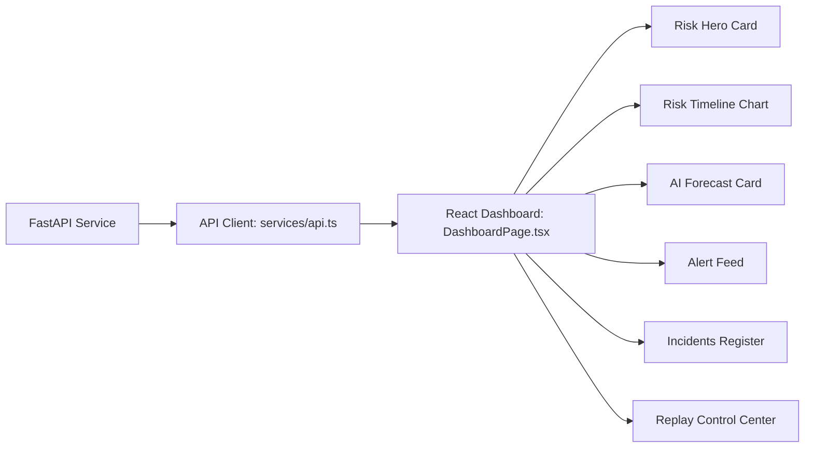

# SENTRANET — Phase 8 SOC Dashboard Documentation

**Project:** SENTRANET — "From detecting attacks to forecasting them."  
**Theme:** Blockchain & Cybersecurity  
**Problem Statement:** SIH26153 (Smart India Hackathon 2026)  
**Category:** Software  
**Phase:** 8 (Security Operations Center Dashboard & API Integration)  

---

## 1. Objective

Phase 8 implements a modern, high-density, professional Security Operations Center (SOC) dashboard for SENTRANET. It connects the validated Phase 7 FastAPI REST API to a responsive, typed React 19 + TypeScript + Vite frontend.

The dashboard makes the core SENTRANET story immediately clear:
$$\text{DETECT} \longrightarrow \text{UNDERSTAND} \longrightarrow \text{FORECAST} \longrightarrow \text{RESPOND}$$

Key presentation goals:
1. Communicate live network composite threat risk ($0.00 - 1.00$).
2. Deliver multi-class supervised classification (XGBoost) and unsupervised divergence (Isolation Forest).
3. Distinguish emerging attack forecasts and estimated Time to Impact (ETA) from existing detected attacks.
4. Visualize chronological risk trajectories on a time-series chart with Phase 5 operational thresholds.
5. Provide fine-grained interactive simulation playback controls over historical telemetry fixtures.
6. Display correlated security incident records and deterministic alert state machine transitions.

---

## 2. Dashboard Architecture

The dashboard interacts with the FastAPI backend through a typed API client, polling stateful endpoints without requiring external brokers, WebSockets, or distributed databases.



### Data Pipeline Overview

1. **Historical Telemetry Windows**: Chronological network flow statistics ($17$ canonical features) stored in Parquet format.
2. **FastAPI Replay Engine**: In-memory background thread advances playback clock at configurable speed ($1\times - 60\times$).
3. **Dual ML Engine & Temporal Risk Fusion**: Generates unified `DecisionObject` containing composite risk, velocity, acceleration, and emergence indicators.
4. **State Machine & Incident Manager**: Emits deterministic alert events (`ALERT_CREATED`, `ALERT_UPDATED`, `ALERT_RESOLVED`) and manages correlated incident lifecycles.
5. **REST API**: Exposes strictly typed JSON endpoints.
6. **React Frontend**: Polls endpoints dynamically, updates state in-place, and provides accessible visual feedback.

---

## 3. UI Component Structure

```
frontend/src/
├── types/
│   ├── index.ts                      # Strict types matching FastAPI schemas
│   └── api.ts                        # Re-export alias
├── utils/
│   └── formatters.ts                 # Formatting, Phase 5 thresholds, semantic tokens
├── services/
│   └── api.ts                        # Centralized typed HTTP API service
├── lib/
│   └── api.ts                        # Re-export alias
├── hooks/
│   ├── useSystemStatus.ts            # System health polling & visibility tracking
│   ├── useReplay.ts                  # Replay simulation lifecycle management
│   ├── useCurrentRisk.ts             # Telemetry & composite risk state
│   ├── useTimeline.ts                # Time-series trajectory data
│   ├── useAlerts.ts                  # Alert feed & active alert status
│   ├── useIncidents.ts               # Incident register & active incident tracker
│   └── useNotifications.ts           # Non-spammy event toast dispatcher
├── components/
│   ├── common/
│   │   ├── SimulationBanner.tsx      # Discloses synthetic replay environment
│   │   ├── MetricBadge.tsx           # Semantic status & severity badges
│   │   ├── RiskGauge.tsx             # 4-segment visual threshold gauge
│   │   ├── NotificationToast.tsx     # Toast overlay for alerts & forecasts
│   │   └── LoadingSkeleton.tsx       # Accessible card & table loaders
│   ├── layout/
│   │   └── Header.tsx                # Brand, system badges, view toggle, refresh
│   ├── dashboard/
│   │   ├── SystemStatusBar.tsx       # Model readiness & feature schema bar
│   │   ├── RiskHeroCard.tsx          # Numerical score, trend, and likelihood
│   │   ├── ForecastCard.tsx          # Emergence vector, ETA, trigger reasons
│   │   ├── AttackClassificationCard.tsx # Multi-class winning vector & confidence
│   │   ├── AnomalyCard.tsx           # Isolation forest divergence & status
│   │   ├── ActiveIncidentCard.tsx    # Active incident summary & metrics
│   │   └── AttackTimeline.tsx        # Vector transition pipeline
│   ├── charts/
│   │   └── RiskTimelineChart.tsx     # Recharts line chart with reference bands
│   ├── alerts/
│   │   └── AlertFeed.tsx             # Filterable chronological alert event list
│   ├── incidents/
│   │   ├── IncidentTable.tsx         # Incident log with full sorting & metrics
│   │   └── IncidentDetailModal.tsx   # Detailed modal dossier for incidents
│   ├── replay/
│   │   ├── ReplayControls.tsx        # Start, Pause, Step, Stop, Reset buttons
│   │   └── ReplayStatusCard.tsx      # Progress bar, simulated timestamp, speed
│   └── SystemStatusCard.tsx          # Retained Phase 1 system card
├── pages/
│   ├── DashboardPage.tsx             # Phase 8 SOC Dashboard
│   └── FoundationPage.tsx            # Retained Phase 1 architecture verification
└── App.tsx                           # Master view router & global header integration
```

---

## 4. API Integration

All frontend interactions use `frontend/src/services/api.ts` configured via `VITE_API_BASE_URL` (default: `http://127.0.0.1:8000`).

| Route | HTTP Method | Function | Schema Contract |
|---|---|---|---|
| `/api/health` | GET | Basic service heartbeat | `HealthResponse` |
| `/api/system/status` | GET | Model engines & pipeline health | `SystemStatus` |
| `/api/risk/current` | GET | Latest computed window risk | `AnalyzeResponse` |
| `/api/timeline` | GET | Chronological risk & anomaly points | `TimelineResponse` |
| `/api/alerts/current` | GET | Active alert & incident state | `CurrentAlertResponse` |
| `/api/alerts` | GET | Alert history log (limit, severity) | `List[AlertItemResponse]` |
| `/api/incidents` | GET | Registered incident history | `List[IncidentItemResponse]` |
| `/api/incidents/{id}` | GET | Detailed incident metrics & events | `IncidentDetailResponse` |
| `/api/replay/start` | POST | Launch background replay | `ReplayActionResponse` |
| `/api/replay/stop` | POST | Halt background replay clock | `ReplayActionResponse` |
| `/api/replay/pause` | POST | Pause realtime clock | `ReplayActionResponse` |
| `/api/replay/resume` | POST | Resume realtime clock | `ReplayActionResponse` |
| `/api/replay/step` | POST | Step exactly one window forward | `ReplayActionResponse` |
| `/api/replay/status` | GET | Replay progress & simulation time | `ReplayStatusResponse` |
| `/api/stream/reset` | POST | Flush in-memory temporal states | `{status: str, timestamp: str}` |

---

## 5. Polling Strategy

Phase 8 uses controlled, adaptive REST polling that dynamically scales based on replay simulation activity:

- **System Status**: Polls every 10 seconds.
- **Replay Status**: Polls every 1 second when active; relaxes to 3 seconds when idle.
- **Current Risk Telemetry**: Polls every 1.5 seconds when active; 5 seconds when idle.
- **Timeline Trajectory**: Polls every 2 seconds when active; 5 seconds when idle.
- **Alert Feed**: Polls every 2.5 seconds when active; 6 seconds when idle.
- **Incidents Table**: Polls every 3 seconds when active; 8 seconds when idle.

### Tab Visibility Optimization
All active timers listen to the HTML5 Page Visibility API (`visibilitychange`). When the tab is minimized or hidden, polling intervals are cleared immediately to prevent background resource consumption and network storms. Polling resumes instantly upon reactivation.

---

## 6. Risk Visualization

Risk presentation strictly uses the verified Phase 5 thresholds:

| Risk Tier | Score Range | Color Token | Semantic Meaning |
|---|---|---|---|
| **LOW** | $0.00 - 0.24$ | Emerald (`#10b981`) | Normal baseline traffic; minimal anomaly |
| **GUARDED** | $0.25 - 0.49$ | Amber (`#f59e0b`) | Minor deviations detected; watchlist state |
| **ELEVATED** | $0.50 - 0.74$ | Orange (`#f97316`) | Pronounced attack probability; watch triggered |
| **HIGH** | $0.75 - 1.00$ | Rose (`#f43f5e`) | High-confidence attack or confirmed incident |

### Accessibility First
Every risk display pairs color with numerical percentage ($0.0\% - 100.0\%$), textual state label (`LOW`, `GUARDED`, `ELEVATED`, `HIGH`), and trajectory arrow ($\uparrow, \downarrow, \rightarrow$).

---

## 7. Forecast Visualization

The AI Forecast card communicates predictive emergence without fabricating claims:
- Visually distinct predictive indicator (`AI FORECAST` with pulse dot).
- Shows emerging vector class (e.g. `Port Scanning`, `DDoS Flooding`).
- Displays estimated Time to Impact (ETA) only when supplied by the backend algorithm.
- Displays `—` when ETA or confidence is null.
- Explains deterministic trigger conditions (e.g., `"Risk crossed HIGH threshold (0.75)"`, `"Rapid velocity acceleration detected"`).
- Inactive state clearly states: *"No active forecast signal"*.

---

## 8. Alert Visualization

- **Alert Feed**: Chronological list of events with severity badges, timestamps, attack vector, and incident links.
- **Severity Filtering**: Filterable by `ALL`, `CRITICAL`, `HIGH`, `MEDIUM`, `LOW`.
- **Real-Time Notification Toasts**: Triggered only on high-value lifecycle transitions (`ALERT_CREATED`, `ALERT_ESCALATED`, `ALERT_RESOLVED`, `FORECAST_TRIGGERED`) with built-in deduplication and automatic 6-second dismissal.

---

## 9. Incident Visualization

- **Active Incident Card**: Prominent card displaying active incident ID, attack vector, peak risk score, peak anomaly score, and forecast trigger status.
- **Incident Register Table**: Displays complete incident history with sorting, peak scores, and event counts.
- **Dossier Modal**: Clicking any incident opens an interactive modal showing creation time, update time, resolution timestamp, confidence, and associated telemetry window logs.

---

## 10. Replay Controls

The Replay Control Center directly controls the backend simulation:
- **Modes**: Realtime Clock, Step-by-Step, Fast Batch.
- **Speeds**: $1\times, 5\times, 10\times, 20\times, 60\times$.
- **Datasets**: Restricted strictly to predefined server-supported identifiers (`validation`, `test`, `train`, `full`). Arbitrary filesystem path traversal is forbidden.
- **Action State Guardrails**:
  - `Start`: Enabled only when idle.
  - `Pause`: Enabled only when running.
  - `Resume`: Enabled only when paused.
  - `Step`: Enabled when paused or in step mode.
  - `Stop`: Enabled when running or paused.
  - `Reset Stream`: Enabled when stopped/idle.

---

## 11. Simulation Boundary & Scientific Honesty

In adherence to non-negotiable rules for academic and technical credibility:
- The persistent banner at the top explicitly labels the session: **HISTORICAL REPLAY // SIMULATION MODE**.
- Zero fabricated network packets, fake live graphs, or synthesized risk numbers are generated in the frontend.
- When no replay is running and no telemetry has been sent, the dashboard shows **NO ACTIVE TELEMETRY** and **NO ACTIVE INCIDENTS**.

---

## 12. Error Handling

- **404 NO_CURRENT_STATE**: Treated as clean uninitialized state rather than a crash.
- **Offline Backend**: Displays a prominent top warning banner with a **Retry Connection** button without unmounting the layout.
- **Conflict / Replay Active (409)**: User-friendly error message informing the user that replay is already in progress.
- **No Raw Tracebacks**: All backend errors are parsed through typed `ApiError` instances.

---

## 13. Responsive Behavior

Tested and verified across desktop and mobile form factors:
- **1440px / 1280px**: Full SOC command layout with side-by-side hero metrics and split alert/incident registers.
- **1024px**: Two-column layout with adapted time-series chart dimensions.
- **768px (Tablet)**: Stacked cards with horizontal scrolling for tables and vector transition pipelines.
- **Mobile**: Collapsible header indicators and readable metric typography.

---

## 14. Testing & Verification

1. **Frontend Production Build**:
   ```bash
   npm run build
   # tsc -b && vite build -> built in ~390ms with 0 errors
   ```
2. **Frontend Linter**:
   ```bash
   npm run lint
   # oxlint -> 0 errors
   ```
3. **Backend Regression Test Suite**:
   ```bash
   PYTHONPATH=. backend/.venv/bin/python -m pytest -q
   # 84 passed, 0 failed across all Phase 1-7 modules
   ```

---

## 15. Manual Verification Results

| Step | Action | Expected Output | Status |
|---|---|---|---|
| 1 | Load dashboard before replay | "NO ACTIVE TELEMETRY", "NO ACTIVE INCIDENTS", System Ready | PASS |
| 2 | Check simulation banner | Discloses Historical Replay mode & validation fixture | PASS |
| 3 | Start Replay (10x realtime) | Clock starts, progress bar increments, risk scores stream | PASS |
| 4 | Stream Benign Traffic | Risk remains in LOW state ($<0.25$), trend stable/falling | PASS |
| 5 | Scanning Attack Vector | Risk crosses $0.50$ into ELEVATED, WATCH alert created | PASS |
| 6 | Attack Peak & Emergence | Incident generated, forecast active, ETA supplied | PASS |
| 7 | Pause / Step / Resume | Replay clock pauses, advances single window, and resumes | PASS |
| 8 | Stop & Stream Reset | Simulation halts, alerts resolve, stream returns to nominal | PASS |

---

## 16. Phase 9 Readiness

Phase 8 provides the complete, production-grade SOC user interface for SENTRANET. The codebase is clean, modular, typed, and ready for Phase 9 (Containerization, Packaging, and Demonstration Delivery).
