# Phase 9: Network Telemetry Ingestion and Feature Aggregation Layer

**SENTRANET — From detecting attacks to forecasting them.**  
*Smart India Hackathon 2026 | Problem Statement: SIH26153 | Theme: Blockchain & Cybersecurity*

---

## 1. Objective

Phase 9 establishes the real-time network flow telemetry ingestion and online feature aggregation layer for SENTRANET. It accepts individual network flow metadata records (`FlowRecord`) from multiple potential sources, validates and normalizes them, aggregates them into deterministic 60-second temporal windows, and computes the exact **17 canonical features** consumed by the existing SENTRANET AI Core (Phase 2 Scaler, XGBoost multi-class classifier, Isolation Forest anomaly detector, Risk Fusion engine, and Temporal Forecast engine).

### Architectural Principle
Phase 9 does **NOT** build a secondary ML pipeline, alter existing models, retrain parameters, or modify the 17-feature schema. It strictly feeds raw streaming telemetry through causal 60-second windowing into the existing AI inference service.

```mermaid
flowchart LR
    A[Flow Source]
    B[FlowRecord]
    C[Validation]
    D[Normalization]
    E[60s Window]
    F[17 Features]
    G[SENTRANET AI]
    H[Risk + Forecast]
    I[Alerts / Incidents]
    J[FastAPI]
    K[SOC Dashboard]

    A --> B
    B --> C
    C --> D
    D --> E
    E --> F
    F --> G
    G --> H
    H --> I
    I --> J
    J --> K
```



---

## 2. Canonical FlowRecord Schema

The ingestion layer operates strictly on flow metadata. No deep packet inspection (DPI) or packet payloads are ever collected, processed, or stored.

Implemented in [`backend/telemetry/flow_schema.py`](file:///Users/zaid/Desktop/PROJECTS/SentraNet-main/backend/telemetry/flow_schema.py):

| Field | Type | Description | Validation Rule |
| :--- | :--- | :--- | :--- |
| `timestamp` | `str` | ISO-8601 or UTC datetime string | Must parse to valid timestamp |
| `src_ip` | `str` | Source IPv4 / IPv6 address | Validated via `ipaddress.ip_address` |
| `dst_ip` | `str` | Destination IPv4 / IPv6 address | Validated via `ipaddress.ip_address` |
| `src_port` | `int` | Transport layer source port | Range `0` to `65535` |
| `dst_port` | `int` | Transport layer destination port | Range `0` to `65535` |
| `protocol` | `str` | Transport protocol | Normalized to `TCP`, `UDP`, `ICMP`, `OTHER` |
| `duration_seconds` | `float` | Duration of flow in seconds | $\ge 0.0$, finite, non-NaN |
| `packets` | `int` | Total packet count in flow | $\ge 0$, integer |
| `bytes` | `float` | Total byte volume in flow | $\ge 0.0$, finite, non-NaN |
| `tcp_flags` | `Optional[Union[str, int]]` | TCP flag representations | Normalized tokens or bitmask |
| `flow_id` | `Optional[str]` | Unique flow identifier | Metadata only |
| `interface` | `Optional[str]` | Ingestion interface name | Metadata only |
| `direction` | `Optional[str]` | Traffic direction | Metadata only |

Extra fields are strictly forbidden (`extra="forbid"`).

---

## 3. Flow Validation

Implemented in [`backend/telemetry/flow_validator.py`](file:///Users/zaid/Desktop/PROJECTS/SentraNet-main/backend/telemetry/flow_validator.py):
- Rejects malformed JSON or invalid types with structured `InvalidFlowException(code="INVALID_FLOW")`.
- Disallows NaN, $\pm\infty$, negative duration, negative bytes, negative packets, and invalid IP addresses.
- Never silently repairs malformed telemetry.

---

## 4. Flow Normalization

Implemented in [`backend/telemetry/flow_normalizer.py`](file:///Users/zaid/Desktop/PROJECTS/SentraNet-main/backend/telemetry/flow_normalizer.py):
- **Protocol**: Normalizes case (`tcp`, `Tcp`, `TCP` $\rightarrow$ `TCP`). Maps non-standard protocols to `OTHER`.
- **TCP Flags**: Converts bitwise integers (`0x02` $\rightarrow$ `SYN`, `0x10` $\rightarrow$ `ACK`, `0x12` $\rightarrow$ `SYN,ACK`) and delimited strings into canonical flag counts and strings.
- **Timestamp**: Preserves original timestamp semantics and timezone offset without silent shifts.

---

## 5. FlowSource Abstraction

Implemented in [`backend/telemetry/flow_sources.py`](file:///Users/zaid/Desktop/PROJECTS/SentraNet-main/backend/telemetry/flow_sources.py):
```python
class FlowSource(Protocol):
    @property
    def source_type(self) -> Literal["historical", "synthetic", "live"]: ...
    def read(self) -> Optional[FlowRecord]: ...
    def __iter__(self) -> Iterator[FlowRecord]: ...
```

Three implementations:
1. `SyntheticFlowSource`: High-speed deterministic generator with configurable seeds and behavioral profiles.
2. `ReplayFlowSource` / `FileFlowSource`: Sequentially parses recorded datasets (CSV / JSONL) into flow records.
3. `LiveFlowSource`: Placeholder interface reserving Phase 10+ IPFIX/NetFlow/eBPF integration without requiring root sniffing permissions now. Calling `read()` raises `NotImplementedError("Live telemetry source not configured.")`.

---

## 6. Window Aggregation

Implemented in [`backend/telemetry/window_aggregator.py`](file:///Users/zaid/Desktop/PROJECTS/SentraNet-main/backend/telemetry/window_aggregator.py):
- Accumulates records into fixed, deterministic 60-second temporal windows:
  $$\text{Window Start} = \text{timestamp.floor('60s')}$$
  $$\text{Window End} = \text{Window Start} + 60\text{ seconds}$$
- Boundaries depend strictly on telemetry timestamps, **never** on HTTP request arrival times.
- When an incoming flow timestamp reaches or exceeds `current_window_end`, the active window emits its 17 features, and a new window opens.

---

## 7. Feature Engineering Semantics

To ensure exact numerical parity with the Phase 2 offline training pipeline:
- `flow_count`: Count of flows in the 60s window.
- `total_packets`: $\sum \text{packets}$.
- `total_bytes`: $\sum \text{bytes}$.
- `avg_packet_rate`: Mean of per-flow packet rates: $\frac{1}{N}\sum \frac{\text{packets}_i}{\text{duration}_i}$ (with safe divide if duration $= 0$).
- `avg_byte_rate`: Mean of per-flow byte rates: $\frac{1}{N}\sum \frac{\text{bytes}_i}{\text{duration}_i}$.
- `unique_sources`: Cardinality of distinct `src_ip`.
- `unique_destinations`: Cardinality of distinct `dst_ip`.
- `avg_packet_size`: Mean of per-flow average packet sizes: $\frac{1}{N}\sum \frac{\text{bytes}_i}{\text{packets}_i}$.
- `avg_flow_duration`: Mean of flow durations: $\frac{1}{N}\sum \text{duration}_i$.
- `syn_flag_count`: Total flows containing `SYN`.
- `ack_flag_count`: Total flows containing `ACK`.
- `privileged_port_ratio`: Proportion of flows targeting ports $< 1024$.

---

## 8. 17-Feature Contract

The exact 17 canonical features in exact model order:
1. `flow_count`
2. `total_packets`
3. `total_bytes`
4. `avg_packet_rate`
5. `avg_byte_rate`
6. `unique_sources`
7. `unique_destinations`
8. `avg_packet_size`
9. `avg_flow_duration`
10. `syn_flag_count`
11. `ack_flag_count`
12. `privileged_port_ratio`
13. `rolling_5_flow_count`
14. `rolling_5_total_packets`
15. `rolling_5_total_bytes`
16. `rolling_5_avg_byte_rate`
17. `rolling_5_unique_sources`

Validated by [`backend/telemetry/ai_adapter.py`](file:///Users/zaid/Desktop/PROJECTS/SentraNet-main/backend/telemetry/ai_adapter.py) before passing to inference.

---

## 9. Rolling Feature Semantics

Rolling features preserve historical context over the last $K=5$ completed 60-second windows:
$$\text{rolling\_5\_metric}(t) = \frac{1}{\min(t+1, 5)} \sum_{k=0}^{\min(t, 4)} \text{base\_metric}(t-k)$$
Strictly causal: references only windows $\le t$. Never references future windows.

---

## 10. Streaming / Offline Feature Equivalence

A dedicated verification test in [`tests/test_feature_equivalence.py`](file:///Users/zaid/Desktop/PROJECTS/SentraNet-main/tests/test_feature_equivalence.py) passes identical flow sequences through:
1. The offline preprocessing pipeline (`FeatureEngineer` $\rightarrow$ `TemporalWindowAggregator`).
2. The streaming ingestion aggregator (`WindowAggregator`).

**Result**: All 17 features matched across all test windows within floating-point tolerance ($< 10^{-4}$).

---

## 11. Temporal Causality and Data Leakage

Verified in [`tests/test_temporal_causality.py`](file:///Users/zaid/Desktop/PROJECTS/SentraNet-main/tests/test_temporal_causality.py):
- Windows $t_0, t_1, t_2$ are processed sequentially.
- The AI inference output and features for $t_1$ are captured.
- Future window $t_2$ is ingested with anomalous volumetric traffic.
- Asserted that $\text{Decision}(t_1)$ and $\text{Features}(t_1)$ remain completely unchanged.
- Flows arriving out of order into completed windows are rejected with `OutOfOrderFlowException(code="OUT_OF_ORDER_FLOW")`.

---

## 12. Synthetic Flow Generator

Implemented in [`backend/telemetry/synthetic_source.py`](file:///Users/zaid/Desktop/PROJECTS/SentraNet-main/backend/telemetry/synthetic_source.py):
- Generates flow metadata using fixed seeds (`seed=42`) for 100% deterministic reproducibility.
- **Profiles**:
  - `BASELINE`: Diverse enterprise traffic, mixed web ports, low SYN flags.
  - `SCANNING`: High destination dispersion, short durations ($<0.05$s), SYN-heavy.
  - `DDOS`: Concentrated destination targets, high packets, large byte volume.
  - `BOTNET`: Periodic beaconing to C2 addresses, steady packet counts.
  - `scenario_1`: Progression: Baseline (0–3m) $\rightarrow$ Scanning (3–5m) $\rightarrow$ DDoS (5–7m) $\rightarrow$ Baseline (7m+).

---

## 13. FastAPI Telemetry Endpoints

Implemented in [`backend/api/routes/telemetry.py`](file:///Users/zaid/Desktop/PROJECTS/SentraNet-main/backend/api/routes/telemetry.py):

| Method | Endpoint | Request Body | Description |
| :--- | :--- | :--- | :--- |
| `POST` | `/api/telemetry/flow` | `FlowIngestRequest` | Ingests 1 flow record. Does not run AI inference until window completes. |
| `POST` | `/api/telemetry/flush` | *None* | Flushes current accumulation window and runs AI inference. |
| `GET` | `/api/telemetry/status` | *None* | Returns stream status, active window boundaries, and latest risk score. |
| `POST` | `/api/telemetry/synthetic/start`| `SyntheticStartRequest` | Starts synthetic generator thread feeding `StreamProcessor`. |
| `POST` | `/api/telemetry/synthetic/stop` | *None* | Halts synthetic generator and flushes partial window. |
| `POST` | `/api/telemetry/synthetic/pause`| *None* | Pauses active synthetic generator thread. |
| `POST` | `/api/telemetry/synthetic/resume`| *None* | Resumes paused synthetic generator. |
| `GET` | `/api/telemetry/synthetic/status`| *None* | Returns synthetic generator run status and counters. |
| `POST` | `/api/telemetry/reset` | *None* | Resets window buffer and counters (returns 409 if stream running). |

---

## 14. Stream Processor Singleton

Implemented in [`backend/telemetry/stream_processor.py`](file:///Users/zaid/Desktop/PROJECTS/SentraNet-main/backend/telemetry/stream_processor.py):
- Thread-safe singleton (`StreamProcessor.get_instance()`).
- Bounded memory buffers: circular deque for recent windows (`maxlen=100`).
- Direct in-memory coupling: `SyntheticStreamService` feeds `StreamProcessor` directly without local HTTP loopback overhead.

---

## 15. Dashboard Integration

Updated in [`frontend/src/pages/DashboardPage.tsx`](file:///Users/zaid/Desktop/PROJECTS/SentraNet-main/frontend/src/pages/DashboardPage.tsx):
- **Data Source Selector** (`DataSourceSelector.tsx`):
  - `Historical Replay` (AVAILABLE)
  - `Synthetic Stream` (AVAILABLE)
  - `Live Telemetry` (NOT CONFIGURED / DISABLED)
- **Synthetic Stream Controls** (`SyntheticStreamControls.tsx`):
  - Scenario & profile selectors (`scenario_1`, `BASELINE`, `SCANNING`, `DDOS`, `BOTNET`).
  - Speed multipliers (1x, 5x, 10x, 25x, 50x).
  - Seed input (default: 42).
  - Interactive Start, Pause, Resume, Stop, Flush, and Reset controls.
  - Telemetry metrics: Ingested flows, completed windows, active window flows, active window timestamp.
- **Unified Simulation Polling**:
  - Automatically polls risk, timeline, alerts, and incidents during synthetic stream execution.

---

## 16. Telemetry Source Types

| Source Type | Availability in Phase 9 | Semantics |
| :--- | :--- | :--- |
| `historical` | **AVAILABLE** | Replays historical dataset fixtures chronologically. |
| `synthetic` | **AVAILABLE** | Generates flow metadata using deterministic statistical profiles. |
| `live` | **NOT CONFIGURED** | Placeholder for future raw packet or IPFIX/NetFlow collectors. |

---

## 17. Privacy & Security Model

- **Metadata Only**: No packet contents, headers, or payloads are stored or processed.
- **Zero DPI**: Features are derived strictly from flow volume, ports, timestamps, and TCP flag metadata.
- **No LLM Leakage**: Gemini / LLM integrations receive only high-level incident context and trajectory explanations, never raw network traffic.
- **Strict Validation**: All network IPs and port numbers are strictly validated before entering memory.

---

## 18. Performance Metrics

Tested with `scripts/run_telemetry.py`:
- Ingestion throughput: $> 520$ flows/second in single-thread Python simulation.
- Memory: Bounded deques and window aggregation prevent unbounded heap expansion.
- AI latency: Zero redundant scaling; features feed directly into pre-loaded model singletons.

---

## 19. Testing and Verification Summary

- **Total Backend Tests**: **109 passed** (0 failures, 84 baseline + 25 new tests).
- **Test Categories**:
  - `tests/test_flow_schema_validation.py`: Pydantic validation, IP/port boundaries, normalization.
  - `tests/test_window_aggregator.py`: 60s windows, mathematical correctness, out-of-order rejection.
  - `tests/test_feature_equivalence.py`: 17-feature parity between streaming and offline pipelines.
  - `tests/test_temporal_causality.py`: Causality verification, zero future leakage.
  - `tests/test_synthetic_source.py`: Seed determinism, profile variance, live placeholder.
  - `tests/test_api_telemetry.py`: REST endpoints, conflict management (409s), flush, reset.
- **Frontend Verification**:
  - `npm run build`: Production build passed cleanly with Vite.
  - `npm run lint`: 0 errors.

---

## 20. Limitations

1. Out-of-order flows arriving into already-emitted windows are rejected. Complex out-of-order stream reconciliation or watermarking is not implemented.
2. Synthetic traffic patterns represent synthetic statistical behaviors, not real-world benchmark evaluations.
3. Live network packet capture is not implemented in Phase 9.

---

## 21. Future LiveFlowSource Integration

Phase 10+ will introduce:
- NetFlow v9 and IPFIX metadata listeners (UDP 2055 / 4739).
- Zeek `conn.log` / Suricata `eve.json` log tailing.
- eBPF socket monitoring without kernel packet inspection.

---

## 22. Phase 10 Readiness

With Phase 9 complete, SENTRANET possesses a unified flow ingestion layer capable of ingesting raw flow metadata and converting it into canonical 17-feature vectors for real-time attack forecasting. Phase 10 can now build live IPFIX/NetFlow listeners or production deployment pipelines directly on top of this architecture.
